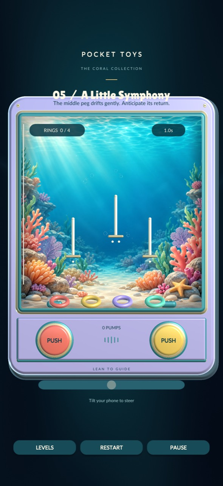
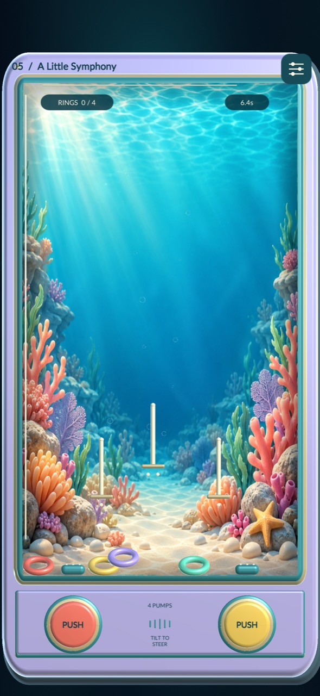

# Pocket Toys Research and Design Baseline

### Audience UX graphics controls gameplay audio and haptics

Prepared for the Pocket Toys project owner  |  8 October 2026  |  Version 1.0

**Recommended direction:** a calm, tactile water-ring toy for adults who want a short, satisfying break, with understandable physics and optional mastery. The first design problem is making each press, movement and landing feel readable and rewarding. Filling the display is useful only when it improves that experience.

This is a proposal for discussion before implementation. It combines external research, a small transparent sample of public player reviews, the supplied iPhone screenshots and inspection of the current Unity project. No game code or build changes are part of this research.

### Decisions this baseline supports

- **Audience.** Start with adult casual players seeking a pleasant break; test nostalgia as a motivation rather than assuming everyone remembers the physical toy.

- **Presentation.** Keep the water toy identity, but compose the active rings, pegs and travel space together. Do not stretch the aquarium around an unchanged level.

- **Interaction.** Compare two clearly defined control concepts before choosing the default. A complete touch alternative must be available if tilt is supported.

- **Feeling.** Use gentle bubble audio and sparse event-based haptics. Validate them during repeated play on a real phone, including sound-off play.

- **Progress.** Make completion satisfying without requiring speed. Keep score chasing subordinate to the core toy experience.

### Reading guide

| Sections | Purpose |
| --- | --- |
| 2-6 | Evidence, proposed audience, current-state audit, comparable games and player review sample |
| 7-13 | Proposed journey, visual design, controls, gameplay, audio, haptics and inclusive quality requirements |
| 14-16 | Decisions to review, prototype research plan and measurable acceptance candidates |
| 17-18 | Linked external references and local evidence register |

**Evidence boundary:** the audience, control preference, session length and proposed numeric targets are hypotheses. They have not been validated with Pocket Toys players. A successful build or automated test does not establish usability or enjoyment.

## 2 What the evidence supports

The strongest conclusion is coherence: controls, physics, graphics, sound and touch feedback need to describe the same action. External sources support that principle; the specific Pocket Toys solution remains a design and testing decision.

| Evidence | Finding | Strength and limit |
| --- | --- | --- |
| Platform guidance [S1](#s1), [S2](#s2), [S3](#s3) | Reachable controls, visible feedback and restrained, meaningful haptics. | Strong design guidance; does not determine our pump strength or preferred control scheme. |
| ESA survey [S4](#s4) | Fun and stress relief are common reported reasons for playing. | 24,216 weekly players aged 16+ across 21 countries. Broad context, not a water-toy market estimate. |
| Motivation research [S5](#s5) | Perceived competence and autonomy relate to enjoyment and preference for further play. | Four studies from 2006 across other games. Supports a lens, not a forecast of retention. |
| Player reviews [S6](#s6), [S8](#s8), [S9](#s9), [S10](#s10) | Sampled players discuss calm, challenge, clarity, interruptions and performance. | 12 purposively selected reviews. Self-selected, storefront ordered and often historical. |
| Our screenshots and code [L1-L4] | Tall tank composition and control mapping need a coordinated review. | Direct evidence of this implementation; no representative user test or instrumented phone session. |

### Research method

Desk research was conducted on 8 October 2026 using official platform documentation, an original academic paper, an industry survey release with methodology, publisher storefront descriptions and public App Store reviews. Five comparable products were selected for either mechanical similarity or a relevant calm-play design pattern. Their current binaries were not installed or played for this report.

The review sample takes the first five distinct I Love Hue reviews, first four Prune reviews and first two Alto's Odyssey reviews in the retrieved US storefront order, plus the one visible Waterful Ring Toss review. Duplicate expanded copies and editorial descriptions were excluded. Dates and reviewer handles are logged in section 6. This is qualitative problem discovery, not representative sentiment analysis.

### How to read recommendations

**Observed** means visible in supplied material or inspected code. **Evidence** means supported by a cited source. **Proposal** means our design judgment. **Validation needed** identifies a question for real players or devices. Broad market statistics do not prove demand, and personal relaxation reports do not justify therapeutic claims.

## 3 Proposed target audience

**Primary audience hypothesis:** adults who enjoy simple tactile or visual games and want a brief, low-pressure break. Recruit broadly from ages 18 to 55+; use 25-44 only as an initial marketing hypothesis to investigate, not an evidence-backed age boundary. There is no basis here for a gender-specific target.

| Segment | Job the game could serve | Design implication |
| --- | --- | --- |
| Primary / Calm casual players | I have a few minutes and want something pleasant that responds to me. | Fast entry, immediate feedback, manageable challenge, easy interruption and return. |
| Secondary / Nostalgic toy players | I want the familiar satisfaction of moving water and landing rings. | Recognizable pumps and water behavior; avoid turning every moment into a scored task. |
| Secondary / Gentle mastery players | I want to get better at a small, understandable skill. | Readable cause and effect, varied peg arrangements and optional personal records. |

### Why this is a reasonable starting point

In the ESA survey, 66% reported playing for fun and 58% for stress relief; 55% played on mobile. Respondents were active gamers recruited through consumer panels, with at least 1,000 per country. These figures establish relevant motivations across a broad population, but say nothing about the size or spending of our niche. [S4](#s4) The direct ring-toy review adds a small nostalgia signal. [S6](#s6)

### Usage situations to investigate

Proposed sessions are roughly 2-5 minutes, with an option to stay longer. Test a seated break, a phone resting on a table, one-handed use and quiet public use. These are recruiting scenarios, not measured behavior. Phone size, reach, dexterity, hearing and sensitivity to motion matter more to interaction design than a fictional persona biography.

### Boundaries and market unknowns

Do not market primarily to children just because the art resembles a toy. Children, competitive arcade players and people seeking a clinical treatment are not the initial positioning. Accessibility needs should be accommodated across the audience, not treated as a separate diagnosis-based marketing segment.

The evidence is mainly English-language and US storefront material. India is included in the global survey, but there is no India-specific demand, pricing or language conclusion here. Launch geography, localization, willingness to pay and acquisition channels require separate validation. No revenue, download or retention forecast is justified.

## 4 Current experience audit

**Observed:** the earlier layout spends substantial space on branding and navigation. The later layout enlarges the chamber vertically while the level objects stay near its floor. The game needs a coordinated composition, not another independent height adjustment. [L1-L3]

- **Layout.** The later image has extensive empty water above the pegs. A still image cannot show all ring trajectories, but the code confirms a taller chamber with unchanged authored peg positions and ring geometry. This is a composition risk, not proof that every frame is empty.

- **Control meaning.** Both pumps apply vertical lift, strongest near their own nozzle; tilt or the slider supplies horizontal motion. That division needs to be learned and visually communicated. [L3]

- **Visual hierarchy.** Detailed coral sits behind the lowest rings. Pegs, ring openings and capacity indicators need clear separation from that art at normal phone viewing distance.

- **Sensory feedback.** The user rejected the earlier pump sound. The newer synthesized bubble cluster and existing light/medium haptics have not been validated as pleasant during sustained phone play. [L1,L4]

## 5 Comparable games and design lessons

These are design references, not rankings or proof of commercial demand. Storefront feature descriptions represent publisher claims. Borrow principles while retaining original assets, interaction details and identity.

| Reference | Relevant pattern | Implication for Pocket Toys |
| --- | --- | --- |
| Waterful Ring Toss / iOS, huseyin darcanli [S6](#s6) | Direct nostalgia positioning; one visible reviewer dislikes the timer and level structure. | Test unpressured toy play. One old review cannot establish majority preference. |
| Waterful Ring Toss / Android, QazPolma [S7](#s7) | A separate game advertises timed waves, charged bursts and movable controls. | The same physical inspiration supports an arcade direction. Choose ours deliberately; avoid confusing the two products. |
| I Love Hue [S8](#s8) | Sampled reviews value calm presentation, color and challenge; some discuss ad friction. | Calm can coexist with effort. Keep interruption and purchasing clarity in any future business design. |
| Prune [S9](#s9) | Reviewers describe evocative art, progression and sound; one reports unclear cues and missed swipes. | A beautiful scene does not excuse ambiguous rules or unreliable-feeling input. |
| Alto's Odyssey [S10](#s10) | Publisher describes one-touch play and a separate Zen mode without scores, coins or power-ups. | Optional mastery and unpressured play can be separated. A historical performance complaint reinforces device testing. |

### Recommended identity

**A small water toy with a satisfying skill loop.** The recognizable action is pressing a pump, watching a ring rise, guiding its descent and seeing it settle onto a peg. The aquarium is the setting. The player's readable influence on the rings is the product.

Preserve the appealing material vocabulary: rounded plastic, clear water, warm pegs and contrasting rings. Avoid adding currencies, collection screens, daily tasks or many new mechanics to compensate for an unproven core interaction. A future free-play option is worth testing; it is not automatically part of the next build.

### Business implication for later

Protect uninterrupted play while testing whether people value the toy enough to return. If monetization is considered later, test a clearly explained model separately. This report neither recommends purchasing services nor establishes a price. Positive competitor reviews and star ratings cannot reveal their profitability or our willingness to pay.

## 6 Player review evidence log

The 12 records below are paraphrases of a small convenience sample, not votes for a feature. All were accessed on 8 October 2026. Month-and-day dates without a year are preserved as displayed; a year has not been inferred. Source links are in sections 17-18.

| Source and reviewer | Displayed date | Relevant observation |
| --- | --- | --- |
| Waterful / Moonlight Flowers [S6](#s6) | 24 Jun 2018 | Nostalgia; wants endless play; dislikes timer pressure. |
| Hue / ECWriterite [S8](#s8) | Apr 26 | Values design and avoiding gameplay interruptions. |
| Hue / Ryanne.E [S8](#s8) | Jun 7 | Likes restrained visuals and sound; requests solution replay. |
| Hue / Fisherman18735 [S8](#s8) | Jul 28 | Enjoys colors and levels; accepts the ad load. |
| Hue / SunRose [S8](#s8) | Sep 12 | Infrequent gamer drawn by color and satisfaction. |
| Hue / Marieell [S8](#s8) | Jul 14 | Likes challenge; dislikes ads and unclear removal terms. |
| Prune / Vlo1 [S9](#s9) | 11 Apr 2016 | Praises play and art; dislikes perceived narrative meaning. |
| Prune / Beenplayinawhile [S9](#s9) | 27 May 2017 | Enjoys depth; questions symbols and inconsistent swipe response. |
| Prune / Tigerbellies [S9](#s9) | 9 Apr 2016 | Values beauty and personal calm; describes bedtime use. |
| Prune / kirkland1993 [S9](#s9) | 20 Mar 2020 | Initially unimpressed; later values progression and soundtrack. |
| Alto / Straylock [S10](#s10) | 23 Feb 2018 | Praises visuals; wants a stronger motivating context. |
| Alto / TheEternityCode [S10](#s10) | 22 Feb 2018 | Hitching spoils satisfaction; developer later reports an optimization update. |

### Interpretation and counterevidence

The sample suggests questions about calm, agency, readable goals and sensory restraint. It also resists simplistic conclusions: some players accept ads while others dislike them; attractive simplicity can initially feel uninteresting; relaxation and challenge can coexist. Individual medical or diagnostic claims in reviews are not treated as evidence of health benefit.

Older reviews describe older versions. The Alto complaint is historical, not a claim about current performance. Store ordering, survivorship, language and reviewer self-selection bias the sample. No sentiment percentage, market share or causal retention claim is calculated.

## 7 The proposed player journey

**Experience promise:** I can understand what my press did, improve my next attempt and enjoy the result without feeling rushed. The following journey is a proposal, not a verified description of the current game.

| Moment | Player need | Proposed response |
| --- | --- | --- |
| First entry | What is this, and what do I do? | Show the toy promptly. Demonstrate one ring landing on a peg, then let the player try. |
| First press | Did that work? | Button compression, local jet and visible ring movement share one clear onset. |
| First descent | How do I influence the landing? | Teach the selected steering method only when useful. Allow time to observe. |
| First success | Did I earn it? | A visible settled state, updated ring count and a brief soft confirmation. |
| A miss | What can I change? | Ring stays recoverable; no failure alarm. Offer an optional contextual hint after repeated difficulty. |
| Completion | What now? | Show the completed arrangement briefly. Offer Continue, Replay and a clear exit. |
| Interruption | Will I lose my place? | Pause safely; make resume obvious. Define and test what survives an app restart. |

### Onboarding through action

Use one ring and one generous peg first. Teach pump, observe and steer as separate steps. Use short prompts that match the chosen control model; remove each after demonstrated understanding. Keep a replayable practice option in the menu. Microsoft guidance supports accessible objective reminders and interactive tutorials. [S14](#s14)

Do not explain five levels, scores, calibration, skins and all settings before the first press. If tilt is the chosen mode, show a short calibration step at the player's current comfortable angle and provide a visible touch alternative. Explain that a ring must settle, rather than merely overlap a peg, to count.

### Navigation and interruptions

Use a small top-right menu symbol with a generous invisible hit area. It pauses play and exposes Resume, Restart, Levels and Settings in a clear hierarchy. Confirm a restart only when progress would be discarded. Keep the ordinary path short; an accidental tap must not erase an attempt. Menu transitions must not trigger a pump underneath.

Current progress saving is not evidence that an in-progress arrangement survives process termination. That behavior needs an explicit product decision and a device test. [L2-L3]

## 8 Graphics and full screen composition

**Proposal:** the toy should feel intentionally designed for a portrait phone. Use available screen area to improve ring visibility, trajectories and control reach. Screen coverage alone is not a quality metric.

### Compose the active scene first

Define a useful chamber around ring diameter, peg spacing, maximum intended flight and readable landing clearance. Choose a bounded gameplay aspect ratio and scale the entire level coherently. On taller phones, extend quiet scenery or modest margins around that composition. If a taller arena is desired, author its targets and flight times together instead of adding empty height.

Use three visual zones: a quiet top overlay for progress and the menu; a central active chamber; a reachable bottom control area above the home gesture region. The decoration can extend to the screen edges while essential controls stay inside safe areas. Test small and tall phones separately. [S1](#s1)

### Preserve the toy identity without visual clutter

| Layer | Proposed treatment | Review question |
| --- | --- | --- |
| Rings and pegs | Strong silhouettes, readable openings, stable highlights and clear settled state. | Can a player recognize the next landing at arm's length? |
| Coral and water | Lower contrast behind targets; detail concentrated away from flight and landing paths. | Do rings remain visible at the floor and against both light and dark patches? |
| Casing and controls | Thin framing; consistent rounded materials; compression visible outside the thumb. | Does the toy feel tangible without stealing active space? |
| Text and status | Progress first; quiet level identity; optional time and pump statistics. | Can players tell the goal without scanning several competing labels? |

The existing visual design document describes art composed for a 4:5 portrait background. Do not apply nonuniform stretching to make it fit every arena. Use a deliberate crop, extension or newly composed artwork only after the arena is agreed. Preserve ring circularity and peg proportions. [L2]

### Visual approval evidence

Review one art board and proportionate phone frames at 375 x 667 and 390 x 844 logical points, then verify actual safe insets on hardware. Include rings at the floor, mid-flight, crossing pegs and fully stacked. Evaluate moving frames as well as a still image. A quiet area is acceptable if it serves flight readability; decorative emptiness is not a substitute for gameplay.

## 9 Controls to compare before choosing

The current implementation uses two local vertical jets plus lateral tilt or a touch slider. Left and right buttons have different spatial influence, but neither directly steers a ring sideways. A new player may infer a different rule from the two-button layout. [L3]

| Concept | Benefit | Risk and test |
| --- | --- | --- |
| A  Local jets plus tilt / Current model, clarified | Strong physical-toy association; thumbs pump while small tilts guide descent. | Requires grip and device movement. Test neutral calibration, table use and understanding of vertical jets. |
| B  Two directional jets / Prototype alternative | Can potentially support the main game through two touch buttons alone. | Changes the physics and timing skill. Test whether lateral force feels predictable instead of chaotic. |
| C  Local jets plus touch steering / Accessible alternative | Phone can stay still; explicit lateral control. | Three simultaneous tasks may overload the hands. Test reach and whether one-finger sequential input can complete levels. |

### Recommended next comparison

After baseline review, compare A and B in the same simple greybox level, keeping visuals and difficulty as similar as practical. Provide C or another complete non-motion path for A. Do not pick a winner from an attractive screenshot or assume familiar hardware toys make tilt self-explanatory. A combined third control should earn its complexity in tests.

### Interaction contract to define

Start with one accepted press producing one finite pulse. Make the visual down-state immediate. Decide explicitly whether holding repeats, charges or does nothing; do not hide a charge mechanic in the initial experience. If rapid tapping is necessary, offer a lower-effort alternative and evaluate its effect on scoring.

Both pumps should accept independent fingers where appropriate, with no duplicate event from a single contact. Define drag-out behavior, release, app interruption and touches crossing into menus. A settings button should activate safely without an underlying pump. Test the whole finger sequence, not just a synthetic click.

Apple recommends at least 44 x 44 pt for frequent game controls and 28 x 28 pt for secondary ones. Our proposed baseline is at least 44 x 44 pt for all tappable controls, including the small menu icon. Larger pump hit areas should follow comfortable thumb reach, not an arbitrary canvas pixel count. [S1](#s1)

Sensitivity, recalibration and input-mode changes must be reachable without requiring the player to use the input they cannot operate. Motion-critical actions need a digital alternative. [S12](#s12)

## 10 Gameplay and level design baseline

**Core loop proposal:** inspect the ring and target, press a pump, observe the rise, guide or time the descent, settle on a peg, then choose the next ring. The rewarding decision should be what to do next, not how to recover from unclear controls.

### Design the physics as a readable skill

For a comparable ring position, repeated inputs should yield a learnable response. Motion can look organic without hiding the reason for success. Tune flight duration, lateral influence, drag, aperture clearance and settling together. Excessive height increases waiting and can weaken the connection between a press and its result.

Keep near misses recoverable and show why a landing counted. The current implementation locks a ring after a supported, sufficiently slow landing; retaining earned progress is a useful candidate for the calm direction. It trades physical realism for stability, and that tradeoff should be deliberate. Verify it on the moving peg and on stacked rings. [L3]

| Existing level [L2] | Learning purpose to preserve | What to validate |
| --- | --- | --- |
| 1  First Splash | One ring, one peg; understand rise and descent. | Success comes from an understood action rather than unexplained luck. |
| 2  Double Dip | Two rings sharing a peg; discover stacking. | First success stays readable while the second ring moves. |
| 3  Side by Side | Choose between staggered targets. | Target choice adds planning without requiring excessive reach. |
| 4  Scenic Route | A baffle introduces a route problem. | Obstacle is visible and creates a learnable strategy. |
| 5  Little Symphony | A moving middle peg tests timing. | Motion remains readable and does not sharply increase frustration. |

### Progress without compulsory pressure

Current extra-star thresholds reward time and pump efficiency. Those incentives can discourage experimentation. Proposed default: celebrate completion; put time and pump records in a secondary results view. Test optional mastery goals and, later, a free-play mode before adding either to scope. Keep ordinary play free of countdown failure.

Do not calibrate difficulty with an automated solver alone. A solver proves some states are reachable; it cannot tell whether a person understands, enjoys or physically tolerates the controls. Existing time and pump thresholds must remain provisional until novice observations. [L2]

Introduce one new demand at a time. More rings, narrower clearances, moving targets and stronger currents should not all increase in the same step. Five distinct, well-tested levels are more useful for validating the core than a large collection of untested variants.

## 11 Sound direction and listening tests

**User requirement:** pumping should sound like gentle bubbles. The earlier sound was rejected. The newer synthesized cluster is a candidate, not a confirmed solution. Its quality must be judged with the repeated action and the phone speaker, not only with a waveform or desktop headphones. [L1,L4]

### Proposed sound character

Aim for a soft underwater release: rounded onset, a few irregular small bubbles and a short, quiet decay. Avoid a hard click, broad hiss, bass thump, squeak or strong musical pitch on every press. Leave silence between events. Slight controlled variation can reduce repetition, but random pitch shifts must not make the game sound comic or chaotic.

| Event | Proposed sound | Role in the mix |
| --- | --- | --- |
| Pump | Short gentle bubble cluster with immediate soft onset. | Frequent and quiet; should remain tolerable after many presses. |
| Ring contact | Very light, damped material tap only for meaningful contact. | Lower priority; suppress a collision chatter cascade. |
| Ring settles | Small rounded water or glass-like confirmation. | Distinct from a pump, without a loud reward spike. |
| Level complete | Brief warm resolution, then space to enjoy the scene. | One event; do not stack several loud celebrations. |
| Water and music | Sparse optional ambience and restrained music. | Never mask the input response or the landing cue. |

### Evaluate candidates before implementation

Prepare two or three samples matched for perceived loudness: restrained synthesized bubbles, an original or appropriately licensed water recording, and a hybrid. Compare single presses, alternating pumps and sustained rapid play. Use neutral labels A, B and C; do not tell listeners which is intended to sound more relaxing. No audio asset is being purchased or replaced in this research.

Ask what each sound suggests, whether it matches the action, and which becomes tiring over two minutes. Repeat on the phone speaker at low and normal comfortable volume, headphones and mono output. Measure peaks and headroom under overlapping events, then listen for distortion and harshness. A lower amplitude alone does not remove an unpleasant timbre.

### Player control and interruptions

Provide independent effects and music controls, remembered between sessions. Define expected Silent Mode and other-audio behavior, then test the chosen iOS audio session configuration; these behaviors depend on category. [S15](#s15) Essential state must remain visible with all sound disabled. Do not make sound the only way to know a ring landed.

## 12 Haptics as meaningful touch feedback

Evidence from Apple and Android favors feedback with a clear cause, restraint and a relationship to the visible action. Apple also recommends optional haptics and warns that repeated effects can become tiring. Android emphasizes consistent effects and hardware differences. [S2](#s2), [S3](#s3)

**Current code:** the native iOS bridge uses a light impact for a pump, medium impact for a catch and a success notification for completion. A shared 0.1-second throttle exists. This confirms event mappings, not perceived strength or timing on the user's phone. [L4]

| Event | Proposed tactile treatment | Avoid |
| --- | --- | --- |
| Accepted pump press | A brief, soft, low-strength impact aligned with the button response. | Long buzz; multiple strong pulses for one press. |
| Ordinary collision | Usually no haptic. | Vibration for every bouncing contact. |
| Confirmed ring landing | A small distinct settle cue, slightly clearer than a pump. | A heavy knock that contradicts gentle water. |
| Level completion | One restrained positive pattern. | Overlapping catch, menu and success patterns. |
| Menus and settings | Conventional feedback only when it adds clarity. | Reusing an error or warning pattern as a reward. |

### A proposed event policy

The latest meaningful event should win: level completion outranks a landing, which outranks routine pump feedback. Coalesce closely spaced events and drop stale feedback instead of queuing a vibration after the animation. Continuous background water should not cause constant vibration. These are design proposals for a calmer event mix, not platform requirements.

Treat audio, animation and haptics as one authored response. First test low, normal and off variants on the actual supported iPhone. Include alternating two-thumb input, rapid repeats, a phone on a desk and a longer session. Evaluate whether tactile feedback changes the sensor signal or encourages unnecessary gripping.

### Settings and hardware limits

Keep haptics independently switchable. Add an intensity choice only if a meaningful device-tested range is available. Do not assume every iPhone, iPad or Android device produces equivalent effects, and do not substitute an aggressive generic buzz when a nuanced pattern is unavailable. Visual confirmation remains sufficient to play. [S2](#s2), [S3](#s3)

An on-screen mockup cannot demonstrate haptic quality. A video with converted vibration sounds is also not evidence of what a phone feels like. Any claim that a new haptic pattern is pleasant must wait for hands-on comparison.

## 13 Inclusive experience and device quality

Accessibility should influence the initial interaction, not become an extra settings screen after the game is otherwise finished. These requirements are proposed for the baseline; their implementation and usability still need auditing.

| Area | Proposed baseline | Verification |
| --- | --- | --- |
| Vision | Clear text and target contrast; ring state never depends on color alone. | Inspect every background state. Use 4.5:1 for normal UI text, 3:1 for large text; test real ring silhouettes too. [S11](#s11) |
| Motion | Reduced decorative motion; stable camera; complete touch alternative to tilt. | Disable caustics and ambient bubbles without removing essential ring motion. Check tabletop play. [S12](#s12), [S13](#s13) |
| Motor effort | Generous controls; adjustable sensitivity; no mandatory frantic repeated tapping. | Observe missed taps, reach, grip changes and fatigue across hand sizes. |
| Audio and touch | Independent music, effects and haptics settings; visible event feedback. | Complete a level muted and with haptics off. Test supported and unsupported hardware. [S2](#s2), [S3](#s3) |
| Understanding | Visible goal and progress; repeatable help and a recoverable miss. | Ask a new player what counts as success without explaining first. [S14](#s14) |
| Menus | Readable labels and predictable focus; inspect assistive-technology support. | Audit native accessibility exposure of Unity UI. Do not claim VoiceOver or Switch Control support without testing. |

### Performance is part of feel

Use stable 60 fps as an initial engineering target on the chosen minimum supported device, not as a verified result. Record frame times over a ten-minute session, input response, heat and visible hitching. If the art cannot sustain the target, reduce decorative work before compromising the legibility and response of gameplay. Do not select a lower quality mode solely from nominal device age.

Test cold launch, background and resume, phone lock, low-power conditions, orientation handling, audio-route changes and repeated level transitions. Confirm save integrity separately from in-progress resume. The previous iPhone white-screen regression makes launch and rendering verification a release gate. [L1]

### Accessibility scope to state honestly

This baseline is not an accessibility certification. It does not demonstrate that a blind player can currently complete the spatial game. Menu narration, nonvisual gameplay and switch-only operation require explicit feasibility work and participants who use those access methods. Report support that is demonstrated, not inferred from the presence of settings.

## 14 Decisions to review before code changes

The next discussion should settle the experience direction and what evidence would change it. No recommendation below authorizes implementation by itself; the current task ends with this baseline.

| Priority | Decision | Recommendation and reason |
| --- | --- | --- |
| P0 | Primary experience | Calm tactile toy with light authored challenge. Validate this with the proposed audience before adding a meta-game. |
| P0 | Default controls | Compare local jets plus tilt against two directional touch jets. Keep a complete non-motion path; do not select on intuition alone. |
| P0 | Arena composition | Bound the useful arena and scale level elements coherently. Review short and tall phones with moving gameplay. |
| P0 | Feedback identity | Gentle bubbles, modest material response and sparse haptics. Compare samples on the phone. |
| P0 | Fair completion | Clear landing and recoverable misses; retain earned catches for the calm direction unless testing reveals a problem. |
| P1 | Progress and scoring | Completion first; optional performance information. Revisit star thresholds after human playtests. |
| P1 | Free play | Test demand with a concept, then decide scope. Do not add it just because one competitor reviewer requested it. |
| P2 | Long-term expansion | More toys, skins, monetization and social features follow proof that the core is worth returning to. |

### Proposed order of work after review

**1.** Agree audience and promise. **2.** Review two proportionate layout concepts and a control storyboard. **3.** Approve one simple level for a controlled prototype. **4.** Test controls, sound and haptics in short separate comparisons. **5.** Refine the chosen combination. **6.** Apply it to all five levels only after phone validation.

### Keep a decision record

For every change, record the problem, supporting evidence, proposed behavior, expected outcome, test result and whether to retain it. If a change increases screen coverage but does not improve visibility or control, reject it. If an attractive sound becomes irritating after repetition, revise it. If a control wins only because its level was easier, the comparison is inconclusive.

A reviewed research baseline is not approval of a final art style or input scheme. The first implementation should answer the highest-risk question with the smallest useful prototype, rather than combining every recommendation into a new build.

## 15 Research plan with real players

**Proposed formative round:** recruit 6-8 adult participants outside the development team, including calm casual players, people familiar with physical water toys and players seeking gentle mastery. Include people unfamiliar with the toy, different hand sizes and both smaller and larger iPhones. Seek relevant motor or sensory access needs with consent; never infer a diagnosis.

### A practical session of about 25 minutes

| Stage | Activity | What to capture |
| --- | --- | --- |
| Context  3 min | Ask about recent short mobile sessions, where they play and what makes them stop. | Actual examples and constraints; avoid asking them to endorse our concept. |
| Unprompted start  3 min | Hand over the same starting state. Ask them to try the game. | First action, interpretation of pumps, recognition of goal and requests for help. |
| Control comparison  7 min | Try A and B on equivalent levels, alternating which is first. | Misunderstandings, successful corrections, missed input and comfort. |
| Sensory comparison  5 min | Compare bubble samples at matched loudness, then haptics low, normal and off. | Meaning, harshness, repetition fatigue and perceived timing. |
| Free choice  4 min | Let the player repeat, continue or stop without prompting a preferred choice. | Voluntary replay and reason for choice. |
| Reflection  3 min | Ask what they expected, what felt unfair and what they would change. | Preference with explanation; observed behavior takes priority over compliments. |

### Questions that do not lead the participant

What do you think will happen when you press this? What were you trying to do there? How did you know the ring counted? What caused that miss? How did the sound fit what you saw? Did anything become tiring? When would you actually open this again? Avoid asking whether the new version is better or relaxing before they describe it.

### Analysis and follow-through

Record participant IDs, device, input condition, task order, observations and assistance given. Obtain consent before recording. Store only what is needed for this study; do not collect account credentials. Compare patterns, severity and counterexamples without claiming statistical significance from this small round.

Revise the most serious problems, then run a second round with 6-8 new players. Only after the interaction is stable consider a broader opt-in beta for return behavior and device coverage. A small usability round discovers issues; it cannot estimate market demand, retention or revenue.

## 16 Acceptance candidates and open questions

All numbers below are proposed working gates, not research findings or established industry benchmarks. Review their practicality before the prototype. Small samples should be reported as counts, with observed reasons, rather than impressive-looking percentages.

| Question | Initial acceptance candidate | Evidence needed |
| --- | --- | --- |
| Is the goal understandable? | At least 6 of 8 new players explain the goal and make a purposeful first press within 15 seconds, without coaching. | Observation of first exposure, using the same starting state. |
| Does control feel learnable? | At least 6 of 8 can describe how to correct a miss after the first level. Investigate every persistent reversed mental model. | Player explanation plus an observed correction, not completion alone. |
| Is the scene readable? | All test phones show controls inside safe areas; no critical occlusion. At least 6 of 8 identify the next target promptly. | Short and tall phone footage; floor, flight and stack states. |
| Is the response immediate? | Aim for visual press response within 100 ms on tested devices; log outliers. No duplicate pumps or stuck input. | Instrumented timestamps or high-frame-rate recording; not subjective reassurance. |
| Is play pleasant over time? | At least 6 of 8 find a comfortable sensory setting, including off. Investigate every fatigue report; essential cues work muted. | Two-minute repetition comparison and optional longer play; do not force continuation. |
| Is the build reliable? | Zero launch failures, lost completion records or stuck controls in the agreed regression matrix. | Physical-device run log, frame-time capture and save/interruption checks. |

### Questions still open

Does nostalgia attract people who then stay for the skill? Can two touch controls provide enough agency without tilt? Is a bounded arena more satisfying than a tall authored arena? Do players want unrestricted play, short levels or both? Does a visible timer motivate or distract? Which bubble timbre survives repeated use? How much haptic feedback is too much on each device?

### Definition of ready for the next broader build

The owner has reviewed the baseline; one control model and composition have been selected with evidence; first-level goals and response are understood by new players; repeated audio and haptics are acceptable; the full five-level journey has been checked on physical phones; remaining limitations are explicitly recorded.

**No implementation has been performed for this research.** The next step is to discuss the audience, experience promise, control comparison and composition before making a new build.

## 17 External source register

Source IDs beside findings identify the entries here. Each linked source title opens the original page. External material was accessed on 8 October 2026. No long extracts or competitor artwork are reproduced.

### S1

**Apple — Game controls**

[Game controls](https://developer.apple.com/design/human-interface-guidelines/game-controls)

Official guidance. Touch reach, safe areas, minimum sizes and feedback. Current page; accessed 8 Oct 2026.

### S2

**Apple — Playing haptics**

[Playing haptics](https://developer.apple.com/design/human-interface-guidelines/playing-haptics)

Official guidance. Meaning, consistency, restraint, optional feedback and device considerations. Accessed 8 Oct 2026.

### S3

**Android Developers — Haptics design principles**

[Haptics design principles](https://developer.android.com/develop/ui/views/haptics/haptics-principles)

Official guidance. Effect quality, purposeful feedback and hardware-aware design. Accessed 8 Oct 2026.

### S4

**Entertainment Software Association — 2025 Global Power of Play findings and methodology**

[2025 Global Power of Play findings and methodology](https://www.theesa.com/global-report-video-games-transcend-entertainment-affect-positive-change-in-players-lives/)

Published 8 Oct 2025. AudienceNet survey of 24,216 weekly players, ages 16-65+, 21 countries. Industry-sponsored, self-reported context.

### S5

**Ryan, Rigby and Przybylski — The Motivational Pull of Video Games**

[The Motivational Pull of Video Games](https://selfdeterminationtheory.org/SDT/documents/2006_RyanRigbyPrzybylski_MandE.pdf)

Original 2006 paper, Motivation and Emotion, DOI 10.1007/s11031-006-9051-8. Four studies; not a mobile water-toy evaluation.

### S6

**Apple App Store — Waterful Ring Toss by huseyin darcanli**

[Waterful Ring Toss by huseyin darcanli](https://apps.apple.com/us/app/waterful-ring-toss/id1273577327)

Publisher description and one visible US player review dated 24 Jun 2018. Small, historical qualitative signal.

### S7

**Google Play — Waterful Ring Toss by QazPolma**

[Waterful Ring Toss by QazPolma](https://play.google.com/store/apps/details?id=org.qazpolma.waterful&hl=en)

Publisher feature description; listing reports update 16 Jun 2026. Separate product from S6; no player-review inference used.

### S8

**Apple App Store — I Love Hue ratings and reviews**

[I Love Hue ratings and reviews](https://apps.apple.com/us/app/i-love-hue/id1081075274?platform=iphone&see-all=reviews)

US storefront. First five distinct retrieved reviews coded; displayed month/day dates omit year. Accessed 8 Oct 2026.

## 18 Sources and local evidence

### S9

**Apple App Store — Prune ratings and reviews**

[Prune ratings and reviews](https://apps.apple.com/us/app/prune/id972319818?platform=iphone&see-all=reviews)

US storefront. First four distinct player reviews coded, dated 2016-2020. Editorial copy excluded. Accessed 8 Oct 2026.

### S10

**Apple App Store — Alto's Odyssey description and reviews**

[Alto's Odyssey description and reviews](https://apps.apple.com/us/app/altos-odyssey/id1182456409)

Publisher description and first two distinct displayed player reviews, dated Feb 2018. Developer response notes subsequent performance update.

### S11

**Microsoft Game Dev — XAG 102 Contrast**

[XAG 102 Contrast](https://learn.microsoft.com/en-us/gaming/accessibility/xbox-accessibility-guidelines/102)

Official game accessibility guidance. Applied as a design reference, not a claim of Pocket Toys conformance.

### S12

**Microsoft Game Dev — XAG 107 Input**

[XAG 107 Input](https://learn.microsoft.com/en-za/gaming/accessibility/xbox-accessibility-guidelines/107)

Official guidance. Input alternatives and avoiding unnecessary barriers. Accessed 8 Oct 2026.

### S13

**Microsoft Game Dev — XAG 117 Visual distractions and motion settings**

[XAG 117 Visual distractions and motion settings](https://learn.microsoft.com/en-us/gaming/accessibility/xbox-accessibility-guidelines/117)

Official guidance, updated 4 Mar 2026. UI motion and camera effects; not a demand to remove essential gameplay movement.

### S14

**Microsoft Game Dev — XAG 109 Objective clarity**

[XAG 109 Objective clarity](https://learn.microsoft.com/en-us/xbox/accessibility/xbox-accessibility-guidelines/109)

Official guidance, updated 4 Mar 2026. Clear objectives, progress, interactive tutorials and revisitable help.

### S15

**Apple — Playing audio**

[Playing audio](https://developer.apple.com/design/human-interface-guidelines/playing-audio?changes=_8)

Official guidance. Audio-category choices affect mixing, background behavior and Silent Mode. Accessed 8 Oct 2026.

### Local evidence register

**L1  User evidence.** Conversation reports of the white-screen regression, later successful launch, rejection of the pump sound, and the two supplied iPhone images reproduced in section 4. These are individual observations, not a completed usability study.

**L2  Existing design records.** Docs/LEVEL_DESIGN.md, Docs/VISUAL_DESIGN.md and Docs/RELEASE_READINESS.md in D:/GameDevelopment/CasualGames. These describe intent and past checks; some fixed arena and distribution statements are stale. They are not treated as user approval or proof of quality.

**L3  Implementation inspection.** ToyPresentation.cs, GameHud.cs, FloatingRing.cs, GameSession.cs and SensorInputService.cs. Inspected for camera/arena sizing, input mapping, jet force, settling, scoring and mode selection. The inspected source contains existing uncommitted work; it was not changed for this research.

**L4  Sensory implementation.** ToyAudio.cs and Assets/Plugins/iOS/PocketToysHaptics.mm. Inspected event mapping and current audio/haptic behavior. No fresh phone listening test or tactile test was conducted.
