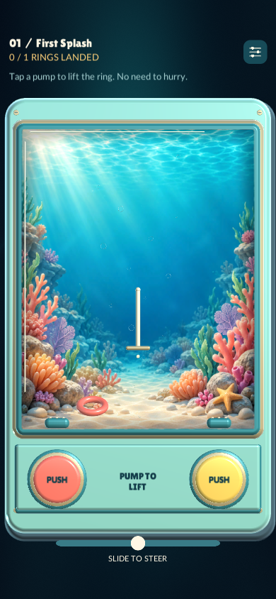
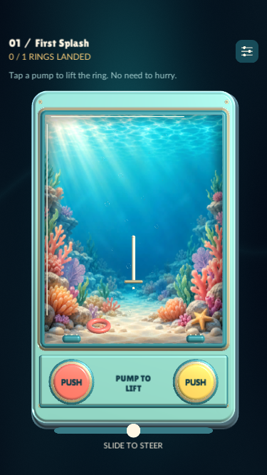
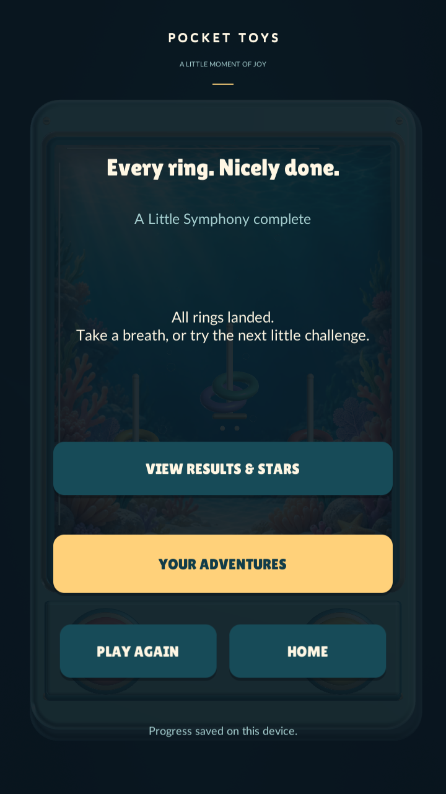

# Pocket Toys 0.2.4: implementation review

This is the first playable implementation of the [research baseline](POCKET_TOYS_BASELINE.md). The [implementation record](IMPLEMENTATION.md) covers decisions, automated checks and the phone review procedure.

## Composition

The water retains the same proportions on different phones. Rings and targets share one bounded arena; the goal sits above it and the controls remain below it. These are Unity renders with simulated safe areas, not photographs from a newly installed iPhone build.

| Tall phone, 390 × 844 | Short phone, 375 × 667 |
| --- | --- |
|  |  |

The short phone uses more side space to keep the full toy, instructions and steering usable. Stretching the chamber independently would distort the art and change the relationship between the rings and pegs. The next physical-device review should assess this tradeoff with hands on the controls.

## Controls and feedback

- Tap the left or right pump to lift nearby rings. Tilt, or use the touch slider, to steer. Let the ring descend over a peg and settle.
- Top-right settings pauses the attempt. How to play is available there, along with comfort settings, controls/calibration and restart confirmation.
- First Splash shows contextual guidance. Later levels retain their authored instruction.
- The touch slider centers on release. A held pump does not repeat; each deliberate press produces one pulse.
- [Listen to the candidate pump sound](assets/implementation-pump.wav). This is the synthesized effect at the implemented playback volume, without music or multiple presses. It still needs speaker/headphone and repeated-use evaluation.
- iPhone feedback uses a soft pump impact, a slightly stronger landing impact and one success notification. Effects are optional; hardware feel cannot be judged from these renders.

## Completion

The packaged Windows player reached this screen after actually completing all five levels. The main message celebrates finishing. Results and stars are available on demand, and best records and shell unlocks remain saved.

## What the checks establish

All 43 Unity checks passed. Public-control automation and a separate packaged Windows run completed the five levels. Simulated short/tall portrait checks cover safe-area containment, control alignment and minimum hit height. These checks establish working behavior under those conditions; they do not establish whether first-time players find the game clear, comfortable or enjoyable.

The remaining human review should focus on perceived arena size, understanding of pump versus steering, comfortable reach, audio fatigue and haptic intensity. Record the phone model, iOS version and sensory settings alongside each observation. The candidate is not yet physically verified on the owner's iPhone.
