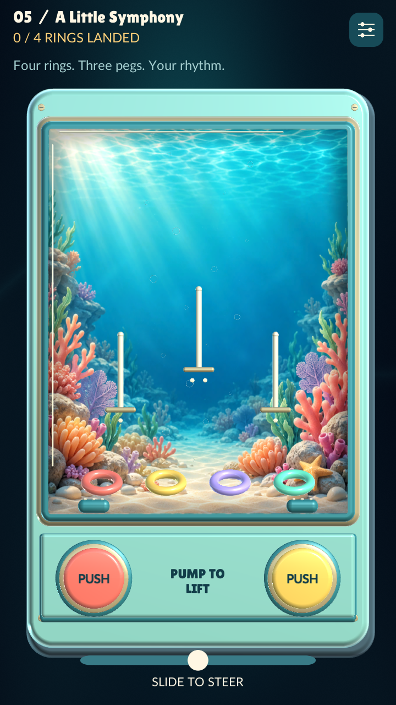
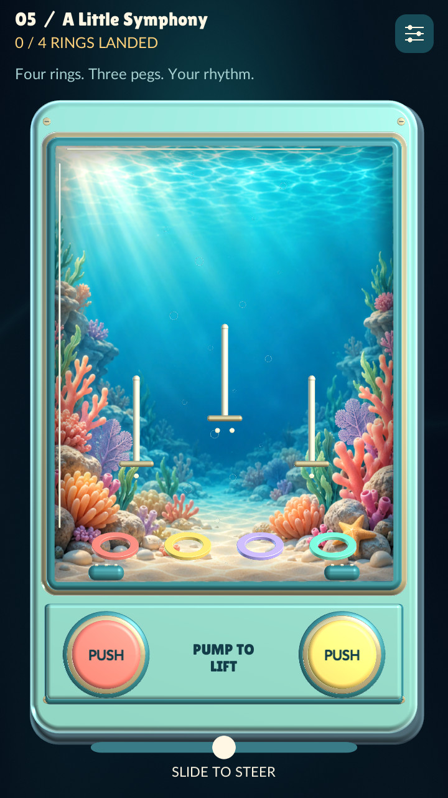
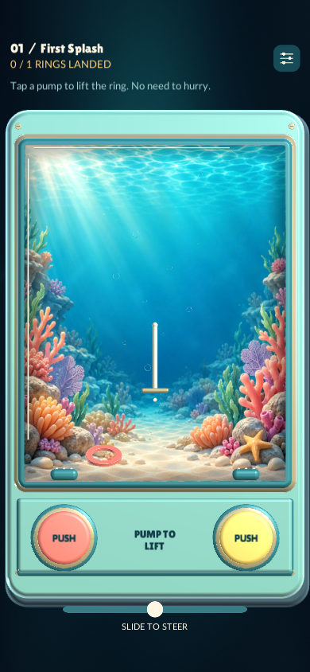
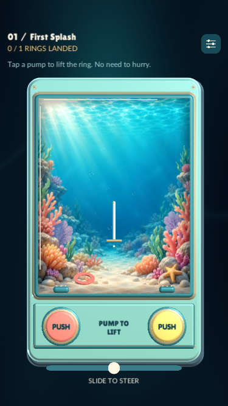

# Pocket Toys: ring identity and new level directions

Update: the subsequent [next-level implementation](NEXT_LEVELS.md) now adds source prototypes for weights, mini collectors, ice, lava and fish. It supersedes this document's earlier “not implemented” status. The renders and 46-test result below remain evidence for the preceding repair revision only; the expansion has not been built or gameplay-tested.

8 October 2026. Follow-up to the [research baseline](POCKET_TOYS_BASELINE.md) and the owner's phone feedback. This document separates the current repair from proposed mechanics. It does not claim that these ideas have been tested with players.

## What the player reported

- A ring can rest on the peg's shelf or on another ring without counting as locked.
- The rounded inner and outer edges make the current rings look like inflatable life buoys.
- Different colours should communicate different weights.
- Some levels could feature many small, more agile rings. Progression should involve new decisions, rather than simply increasing the number of identical rings.

## Current repair candidate

### A physical landing must count

The old code required the ring centre to cross the peg tip within a horizontal offset of 0.15 world units in a particular physics step. That acceptance zone was narrower than the opening through which the peg could physically pass. A ring could therefore miss the bookkeeping check, then slide down and rest on the shelf indefinitely.

A regression on the original round geometry reproduced that exact outcome: a drop starting at offset -0.16 came to rest at approximately (-0.117, -0.202), with zero velocity, while remaining unthreaded and uncounted. After the repair, the same landing counted. Both signs of the offset were checked before changing the graphics.

The candidate recognises a shaft inside the ring's opening throughout the descent. A catch still requires upward physical support, a low-speed settling interval, a plausible shelf/stack height and a free peg slot. Passing the tip alone is insufficient. The ring is neither teleported nor pulled toward a target. Once counted, it remains locked and provides solid support for the next ring.

The supported-stack and moving-peg regressions remain relevant. Desktop reproduction establishes a real defect matching the report; a new installation on the owner's phone is still needed to verify the complete device experience.

### Flat molded plastic, with an unmistakable hole

Replace the circular tube cross-section with a flat annulus: broad flat faces, short inner and outer walls, and a small bevel on each edge. Reduce the broad glossy highlight. Keep the outside diameter essentially unchanged so the player can still see and steer a ring at phone size.

| Dimension | Previous ring | Candidate |
| --- | --- | --- |
| Outside diameter | 0.782 | 0.780 |
| Opening diameter | 0.438 | 0.500 |
| Front-to-back thickness | 0.172 | 0.070 |
| Surface | Glossy rounded tube | Satin flat face, small bevel |

Dimensions are Unity world units. The mesh and compound collision shapes share their nominal opening, outside radius, thickness and tilt. Two rounded contact rails, each made from sixteen capsule segments, approximate the flat annulus. Their cross-section is an approximation of the beveled face, not an exact mesh collision. Rounded contacts avoid sharp collider corners and retain continuous collision detection. This avoids keeping the old thick-tube collisions underneath a thin drawing. Stack-height expectations change accordingly. Performance with a larger population of rings must be profiled on phones.

Current colours remain cosmetic in this repair. Do not silently teach players that colour means weight until distinct behaviours and their introduction are ready together.

## Proposed colour and weight system

Start with three behaviours. Keep each colour's meaning consistent across the campaign. Do not assign an arbitrary new weight to every decorative colour.

| Type | Proposed cue | Feel and useful decision |
| --- | --- | --- |
| Light | Mint, one recessed dot | Rises readily, changes direction promptly, descends slowly. Useful for high routes, but an extra pump can overshoot. |
| Standard | Coral, two recessed dots | Familiar reference response. Introduces the controls before combinations. |
| Heavy | Violet, three recessed dots | Needs more lift, turns less readily, descends sooner. Useful for a low route while a light ring remains above it. |

The dots and a brief labelled introduction convey the same distinction as colour. The [Game Accessibility Guidelines](https://gameaccessibilityguidelines.com/ensure-no-essential-information-is-conveyed-by-a-fixed-colour-alone/) recommend communicating essential information through another channel alongside colour. Check the markings at actual phone size and in greyscale; a tiny illegible pattern is not an adequate substitute.

Keep the thin plastic silhouette for all three types. Making heavy rings into thick doughnuts would recreate the owner's visual complaint. Slight face details can suggest material, but behaviour should be learned through a clear demonstration.

### Initial tuning hypotheses, not final balance

Use standard response as 1.0. First prototype light at about 1.2 times the lift, 0.75 times the downward settling acceleration and 1.15 times the steering response; heavy at about 0.8, 1.25 and 0.85 respectively. Adjust damping separately so light means responsive rather than uncontrollably fast. Start with modest differences and tune through observed attempts.

In the current implementation, pump impulse and steering/settling forces are multiplied by mass. Changing only Rigidbody mass therefore will not create the desired free-flight difference. A future per-ring behaviour profile must explicitly define lift, settling, steering and damping. Mass can still influence collisions. Introduce these profiles in new lessons before retuning existing challenges.

No type should demand rapid repeated tapping or forceful phone movements. Use the same two pumps and optional touch/tilt steering. Explain the effect of the next deliberate action, rather than adding extra controls.

## Proposed levels

| Prototype | Setup | New decision | Recovery |
| --- | --- | --- | --- |
| Feather and Pebble | One light ring and one heavy ring; a high peg and a low peg, with destinations labelled during teaching. | Use a shared pulse to separate their heights, then stop lifting at different times. Observe different responses before adding obstacles. | A miss returns to the floor; caught rings stay safe. |
| Two Routes | One light and one heavy ring; an upper opening and a lower side route. | Choose which ring to finish first so the same pump does not repeatedly disturb both plans. | Broad entry lanes and no countdown. |
| Bubble Garden | Eight small agile rings; two broad funnel collectors; collect any six, with all eight an optional extra. | Use short pulses to guide a group, then change sides as the group separates. | No mandatory hunt for the final tiny ring. There is no disappearing or randomly lost ring. |
| Quiet Current | A small group of mini rings and one clearly visible, slow current zone. | Choose where to enter the current and when to stop pumping. | The current recirculates rings into reachable water instead of trapping them. |

These are proposed prototypes, not new levels in the current build. The collector and partial-quota rules require their own validation and UI; the existing campaign still requires every ring to land on a peg. A successful prototype should make the player change their plan, not merely spend longer pumping.

### What “tiny and agile” should mean

- Start near 65–70% of the standard outside diameter, with eight rings before trying twelve. Those are testing ranges, not promised final counts.
- Agile means quick lift response, quick steering and quick recovery after release. It does not mean random jitter or high maximum speed.
- A ring must remain distinguishable from a bubble and its opening must remain visible on the smallest supported phone. The current bounded layout puts a standard ring around a few dozen screen points wide; verify the smaller candidate in a rendered build and on hardware.
- Use broad collection areas for a group lesson. Scaling down the ring while retaining a narrow individual peg challenge would mostly increase precision demands.
- Coalesce group feedback. Several simultaneous catches should produce one restrained audio/haptic response, with an accurate count, instead of a burst of eight impacts.
- Profile collisions, draw calls, allocation and frame time on an actual lower-end phone. Eight rings with 32 collision segments each are already substantially more contacts than the current one-to-four-ring campaign. Do not assume that simply instantiating more copies is an acceptable final implementation.

## Prototype evaluation

First stabilise landing and approve the ring silhouette. Then test the two-ring weight lesson before combining weight, size, currents and moving targets.

1. Ask a fresh player to predict which ring rises higher after one equal pulse. Repeat after a short demonstration. Record confusion, without coaching away every problem.
2. See whether the player chooses an order or route and can repeat it. Constant indiscriminate pumping indicates that the differences do not yet produce useful decisions.
3. Observe misses: can the player explain the miss and recover without restarting? Every physically settled valid landing must count once, including offset stacks.
4. Test group collection with sound off, with haptics off, with touch steering, and with tilt. Check legibility with colour information removed.
5. Compare the small-ring level with a standard-ring level for satisfaction, visibility and fatigue. Ask whether the group itself was enjoyable, rather than only whether the level was harder.

The research baseline's provisional audience remains adults seeking brief, tactile, low-pressure play, with optional mastery. Small rings and weight differences are hypotheses for richer play within that experience, not evidence of a newly established audience or popularity.

## Validation and review

Unity 6000.3.9f1 validation: **17 EditMode and 29 PlayMode tests passed**. These cover off-centre entry from both sides, physical stacking, offset stacks against a loose neighbor, moving pegs, locked-ring persistence, full-peg limits, side contact without a false score, and steering/lifting a loose ring clear of a locked one. The complete five-level journey passed through public pump and steering controls. Existing input, pause, save, audio and layout checks also pass.

The optional automated QA player was updated to steer outside occupied rims before lifting and to stop treating repeated blocked pumps as progress. It still uses the same controls as a player; it cannot teleport or capture rings. This is evidence of recoverability and reachability, not proof that a first-time player will discover the route or like the difficulty.

Before/after Unity renders at 720 × 1280:

| Previous rounded tube | Flat molded candidate |
| --- | --- |
|  |  |

The new geometry was also reviewed with simulated safe areas at 390 × 844 and 375 × 667. These are rendered previews, not screenshots from an installed phone update.

| Tall phone | Short phone |
| --- | --- |
|  |  |

**Delivery status:** source candidate only. No new IPA or APK was produced by this repair session; the previously delivered 0.2.4 packages do not contain it. Physical iPhone/Android installation, ring readability in motion, collision cost and control feel still need device verification after a new build. No save data, campaign progression or authored peg layout is changed.

New weight profiles, mini rings and collector levels are not implemented by this repair.
